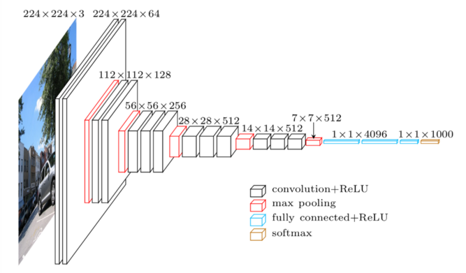

# Encoder Module

The encoder module is used to get a feature representation of the images in the dataset, that is fed into the decoder module. This is the journery taken by the encoder model as we experiment to improve the image captioning system.

1. In the beginning, we start with two pretrained CNNs available in keras - [VGG16](/get_cnn_features.py) and [InceptionV3](/get_inception_features.py). It was observed that VGG16 gives better results so decided to move forward with it. The features were tested in inject model as it has a LSTM learning from both image and text data (which seemed intuitively better). Details about the different models tried can be found [here](#).

You can see the original VGG16 architecture below:

We use the third last layer with 4096 neurons to extract the feature representation.

Inceptionv3 is a lot more complicated and larger. The feature representation from it has a size of 512.

2. After VGG16 gave better results, its feature representation was used for Merge Architecture which performed better.

3. After testing both model styles with variations such as deeper networks, additional number of lstm layers, playing around with number of nerurons, not a lot of improvement was observed. At that point, I had the idea of reducing the vocabulary from research, such as removing the noise of uncommon words etc. Reducing vocabulary helped but not greatly. At this point, I decided to train the pretrained CNNs based on our dataset.

4. The process of fine tuning on Flickr8k was as follows. First, we find out the [n most common words](/get_labels.py) in the caption set. Then, we use these words to construct the target vectors for each image (see [here](/get_targets.py)). Using these target vectors, we train VGG16 model [again](/finetunevgg.ipynb). You can also find the code for finetuning IG3, which did not improve the model though.

However, the finetuned VGG16 really got the model out of a rut as can be seen in the [results](../metrics/README.md).